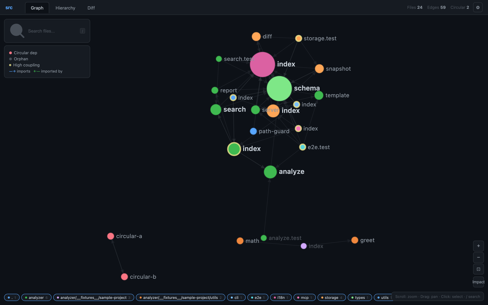
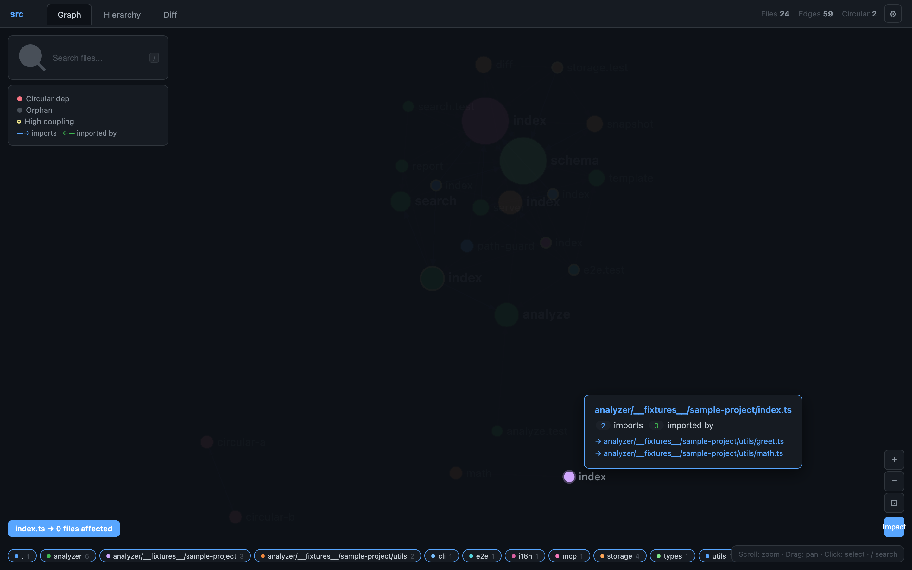
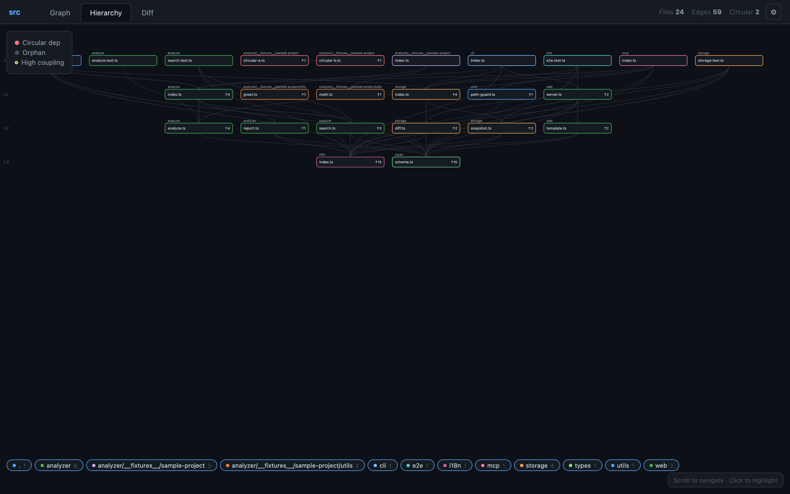
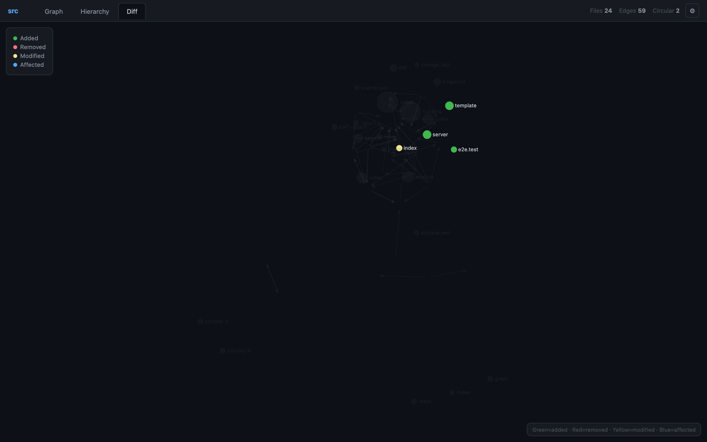

<p align="center">
  
  
  
  
  
</p>

<h1 align="center">archtracker-mcp</h1>

<p align="center">
  <b>Architecture & Dependency Tracker for AI-Driven Development</b><br>
  MCP Server + CLI + Web Viewer + Claude Code Skills
</p>

<p align="center">
  <a href="#quick-start">Quick Start</a> &bull;
  <a href="#features">Features</a> &bull;
  <a href="#web-viewer">Web Viewer</a> &bull;
  <a href="#mcp-tools">MCP Tools</a> &bull;
  <a href="#cli-commands">CLI</a> &bull;
  <a href="#日本語">日本語</a>
</p>

---

## Why archtracker?

When AI agents modify code, they **miss cascading impacts**:

| Problem | Without archtracker | With archtracker |
|---------|-------------------|------------------|
| Agent changes `auth.ts` | Doesn't know 12 files depend on it | Instantly sees all 12 affected files |
| File renamed during refactor | AI references stale paths next session | `context` command gives current valid paths |
| New dependency added | No visibility into coupling increase | Diff report flags the architectural change |
| PR review | Manual dependency tracing | CI auto-checks for architecture drift |

**archtracker-mcp** provides dependency analysis, snapshot diffing, impact simulation, and interactive visualization — all accessible via MCP tools, CLI, web UI, or Claude Code Skills.

## Features

- **Dependency Graph Analysis** — AST-based static analysis via [dependency-cruiser](https://github.com/sverweij/dependency-cruiser)
- **Interactive Web Viewer** — Force-directed graph, hierarchy diagram, diff view with D3.js
- **Impact Simulation** — Click any file to visualize transitive dependents (BFS traversal)
- **Snapshot Diffing** — Save architecture snapshots and detect drift over time
- **MCP Server** — 5 tools for Claude Code / AI agents via Model Context Protocol
- **Claude Code Skills** — 5 slash commands (`/arch-check`, `/arch-snapshot`, etc.)
- **CI Integration** — `--ci` mode + auto-generated GitHub Actions workflow
- **Bilingual** — Full English/Japanese support (auto-detected from `LANG` env)
- **Dark/Light Theme** — Settings persist via localStorage
- **SVG/PNG Export** — Export dependency graphs for documentation

## Quick Start

### Install

```bash
npm install -g archtracker-mcp
```

### 1. Analyze your project

```bash
archtracker analyze --target src
```

### 2. Save a baseline snapshot

```bash
archtracker init --target src
```

### 3. Launch the web viewer

```bash
archtracker serve --target src --watch
# => http://localhost:3000
```

### 4. Check for architecture drift

```bash
archtracker check --target src
```

## Web Viewer

The interactive web viewer provides three visualization modes:

### Graph View (Force-Directed)



- Drag, zoom, and click nodes to explore dependencies
- Click a node to **pin** its highlight — hover other nodes to compare
- Filter by directory with bottom pills
- Adjust gravity, node size, font size, link opacity
- **Impact mode**: click any file to see all transitively affected files



### Hierarchy View (DAG Layout)



- Layered top-down layout showing dependency depth
- Click-to-pin highlighting with detail panel
- Directory-based color coding with legend

### Diff View



- Color-coded visualization of architecture changes
- Green = added, Red = removed, Yellow = modified, Blue = affected
- Available when a snapshot exists for comparison

```bash
# Launch with auto-reload on file changes
archtracker serve --target src --port 3456 --watch
```

## MCP Tools

Add archtracker as an MCP server for Claude Code or any MCP-compatible AI agent:

```json
{
  "mcpServers": {
    "archtracker": {
      "command": "npx",
      "args": ["-y", "archtracker-mcp"]
    }
  }
}
```

| Tool | Description |
|------|-------------|
| `generate_map` | Analyze dependency graph and return structured JSON |
| `save_architecture_snapshot` | Save snapshot to `.archtracker/snapshot.json` |
| `check_architecture_diff` | Compare snapshot with current code, show impacts |
| `get_current_context` | Get valid file paths and architecture summary |
| `search_architecture` | Search by path, impact, criticality, or orphans |

## CLI Commands

```
archtracker init [options]       Generate initial architecture snapshot
archtracker analyze [options]    Comprehensive analysis report
archtracker check [options]      Compare snapshot with current code
archtracker context [options]    Show architecture context (for AI sessions)
archtracker serve [options]      Launch interactive web viewer
archtracker ci-setup [options]   Generate GitHub Actions workflow

Options:
  -t, --target <dir>       Target directory (default: "src")
  -r, --root <dir>         Project root (default: ".")
  -p, --port <number>      Port for web viewer (default: 3000)
  -w, --watch              Watch for file changes and auto-reload
  -e, --exclude <pattern>  Exclude patterns (regex)
  -n, --top <number>       Top N components in analysis (default: 10)
  --save                   Save snapshot after analysis
  --ci                     CI mode: exit 1 if review needed
  --json                   JSON output (context command)
  --lang <locale>          Language: en | ja (auto-detected from LANG)
```

## Claude Code Skills

Copy the `skills/` directory to your project:

```bash
cp -r node_modules/archtracker-mcp/skills/ .claude/skills/
```

| Skill | Description |
|-------|-------------|
| `/arch-analyze` | Run comprehensive architecture analysis |
| `/arch-check` | Compare snapshot with current code |
| `/arch-snapshot` | Save current architecture snapshot |
| `/arch-context` | Initialize AI session with valid paths |
| `/arch-search` | Search architecture (path, impact, critical, orphan) |

## Programmatic API

```typescript
import {
  analyzeProject,
  saveSnapshot,
  loadSnapshot,
  computeDiff,
  formatDiffReport,
  formatAnalysisReport,
} from "archtracker-mcp";

// Analyze
const graph = await analyzeProject("src", { exclude: ["__tests__"] });

// Snapshot
const snapshot = await saveSnapshot(".", graph);

// Diff
const prev = await loadSnapshot(".");
if (prev) {
  const diff = computeDiff(prev.graph, graph);
  console.log(formatDiffReport(diff));
}
```

## CI / CD

### Auto-generate GitHub Actions workflow

```bash
archtracker ci-setup --target src
# Creates .github/workflows/arch-check.yml
```

### Manual setup

```yaml
# .github/workflows/arch-check.yml
name: Architecture Check
on:
  pull_request:
    branches: [main]
jobs:
  arch-check:
    runs-on: ubuntu-latest
    steps:
      - uses: actions/checkout@v4
      - uses: actions/setup-node@v4
        with:
          node-version: "20"
      - run: npm ci
      - run: npx archtracker check --target src --ci
```

## i18n

Language is auto-detected from `LANG` / `LC_ALL` environment variables:

```bash
LANG=ja_JP.UTF-8 archtracker analyze   # Japanese output
archtracker --lang ja check             # Explicit Japanese
```

The web viewer also supports language switching via the settings panel.

## Requirements

- **Node.js** >= 18.0.0
- **TypeScript / JavaScript** project (for dependency analysis)

## Contributing

See [CONTRIBUTING.md](CONTRIBUTING.md) for guidelines.

## License

[MIT](LICENSE) &copy; un907

---

<a id="日本語"></a>

<h1 align="center">archtracker-mcp <sub>(日本語)</sub></h1>

<p align="center">
  <b>AI駆動開発のためのアーキテクチャ & 依存関係トラッカー</b><br>
  MCP サーバー + CLI + Web ビューア + Claude Code Skills
</p>

## なぜ archtracker？

AI エージェントがコードを修正する際、**波及的な影響を見逃します**：

| 問題 | archtracker なし | archtracker あり |
|------|-----------------|-----------------|
| `auth.ts` を変更 | 12ファイルが依存していることを知らない | 影響を受ける全12ファイルを即座に表示 |
| リファクタでファイル名変更 | 次のセッションで古いパスを参照 | `context` コマンドで現在の有効パスを取得 |
| 新しい依存関係を追加 | 結合度の増加が見えない | 差分レポートがアーキテクチャ変更を検出 |
| PRレビュー | 手動で依存関係を追跡 | CIが自動でアーキテクチャドリフトをチェック |

**archtracker-mcp** は依存関係分析、スナップショット差分、影響シミュレーション、インタラクティブな可視化を提供します。MCP ツール、CLI、Web UI、Claude Code Skills からアクセス可能です。

## 機能

- **依存関係グラフ分析** — [dependency-cruiser](https://github.com/sverweij/dependency-cruiser) によるAST静的解析
- **インタラクティブ Web ビューア** — D3.js による力学モデルグラフ、階層図、差分ビュー
- **影響シミュレーション** — ファイルをクリックして推移的な被依存ファイルを可視化（BFS探索）
- **スナップショット差分** — アーキテクチャスナップショットを保存し、ドリフトを検出
- **MCP サーバー** — Model Context Protocol 経由で5つのツールを提供
- **Claude Code Skills** — 5つのスラッシュコマンド（`/arch-check`、`/arch-snapshot` 等）
- **CI 統合** — `--ci` モード + GitHub Actions ワークフロー自動生成
- **多言語対応** — 日本語・英語完全対応（`LANG` 環境変数から自動検出）
- **ダーク/ライトテーマ** — localStorage で設定を永続化
- **SVG/PNG エクスポート** — ドキュメント用にグラフをエクスポート

## クイックスタート

### インストール

```bash
npm install -g archtracker-mcp
```

### 1. プロジェクトを分析

```bash
archtracker analyze --target src
```

### 2. ベースラインスナップショットを保存

```bash
archtracker init --target src
```

### 3. Web ビューアを起動

```bash
archtracker serve --target src --watch
# => http://localhost:3000
```

### 4. アーキテクチャドリフトをチェック

```bash
archtracker check --target src
```

## Web ビューア

インタラクティブな Web ビューアは3つの可視化モードを提供します：

### グラフビュー（力学モデル）


- ドラッグ、ズーム、クリックでノードの依存関係を探索
- ノードをクリックでハイライトを**ピン固定** — 他のノードをホバーして比較
- 下部のピルでディレクトリごとにフィルタリング
- 重力、ノードサイズ、フォントサイズ、リンク透明度を調整可能
- **影響モード**: ファイルをクリックして推移的に影響を受ける全ファイルを表示


### 階層ビュー（DAGレイアウト）


- 依存の深さを示すレイヤー型トップダウンレイアウト
- クリックでピン固定 + 詳細パネル
- ディレクトリベースの色分け + 凡例

### 差分ビュー


- アーキテクチャ変更の色分け可視化
- 緑=追加、赤=削除、黄=変更、青=影響
- スナップショットが存在する場合に利用可能

```bash
# ファイル変更の自動リロード付きで起動
archtracker serve --target src --port 3456 --watch
```

## MCP ツール

archtracker を MCP サーバーとして Claude Code や MCP 互換 AI エージェントに追加：

```json
{
  "mcpServers": {
    "archtracker": {
      "command": "npx",
      "args": ["-y", "archtracker-mcp"]
    }
  }
}
```

| ツール | 説明 |
|--------|------|
| `generate_map` | 依存関係グラフを解析し構造化JSONで返す |
| `save_architecture_snapshot` | `.archtracker/snapshot.json` にスナップショットを保存 |
| `check_architecture_diff` | スナップショットと現在のコードを比較し影響を表示 |
| `get_current_context` | 有効なファイルパスとアーキテクチャサマリーを取得 |
| `search_architecture` | パス、影響範囲、重要度、孤立ファイルで検索 |

## CLI コマンド

```
archtracker init [options]       初期アーキテクチャスナップショットを生成
archtracker analyze [options]    包括的な分析レポート
archtracker check [options]      スナップショットと現在のコードを比較
archtracker context [options]    アーキテクチャコンテキストを表示（AIセッション用）
archtracker serve [options]      インタラクティブ Web ビューアを起動
archtracker ci-setup [options]   GitHub Actions ワークフローを生成

オプション:
  -t, --target <dir>       対象ディレクトリ（デフォルト: "src"）
  -r, --root <dir>         プロジェクトルート（デフォルト: "."）
  -p, --port <number>      Web ビューアのポート（デフォルト: 3000）
  -w, --watch              ファイル変更の監視と自動リロード
  -e, --exclude <pattern>  除外パターン（正規表現）
  -n, --top <number>       分析の上位N件（デフォルト: 10）
  --save                   分析後にスナップショットを保存
  --ci                     CIモード: 要確認ファイルがあれば exit 1
  --json                   JSON形式で出力（context コマンド）
  --lang <locale>          言語: en | ja（LANG から自動検出）
```

## Claude Code Skills

`skills/` ディレクトリをプロジェクトにコピー：

```bash
cp -r node_modules/archtracker-mcp/skills/ .claude/skills/
```

| スキル | 説明 |
|--------|------|
| `/arch-analyze` | 包括的なアーキテクチャ分析を実行 |
| `/arch-check` | スナップショットと現在のコードを比較 |
| `/arch-snapshot` | 現在のアーキテクチャスナップショットを保存 |
| `/arch-context` | 有効なファイルパスでAIセッションを初期化 |
| `/arch-search` | アーキテクチャ検索（パス、影響、重要度、孤立） |

## プログラマティック API

```typescript
import {
  analyzeProject,
  saveSnapshot,
  loadSnapshot,
  computeDiff,
  formatDiffReport,
  formatAnalysisReport,
} from "archtracker-mcp";

// 分析
const graph = await analyzeProject("src", { exclude: ["__tests__"] });

// スナップショット
const snapshot = await saveSnapshot(".", graph);

// 差分比較
const prev = await loadSnapshot(".");
if (prev) {
  const diff = computeDiff(prev.graph, graph);
  console.log(formatDiffReport(diff));
}
```

## CI / CD

### GitHub Actions ワークフローの自動生成

```bash
archtracker ci-setup --target src
# .github/workflows/arch-check.yml を生成
```

## 多言語対応

`LANG` / `LC_ALL` 環境変数から自動検出されます：

```bash
LANG=ja_JP.UTF-8 archtracker analyze   # 日本語出力
archtracker --lang ja check             # 明示的に日本語指定
```

Web ビューアでも設定パネルから言語を切り替え可能です。

## 動作要件

- **Node.js** >= 18.0.0
- **TypeScript / JavaScript** プロジェクト（依存関係分析用）

## コントリビュート

[CONTRIBUTING.md](CONTRIBUTING.md) をご覧ください。

## ライセンス

[MIT](LICENSE) &copy; un907
