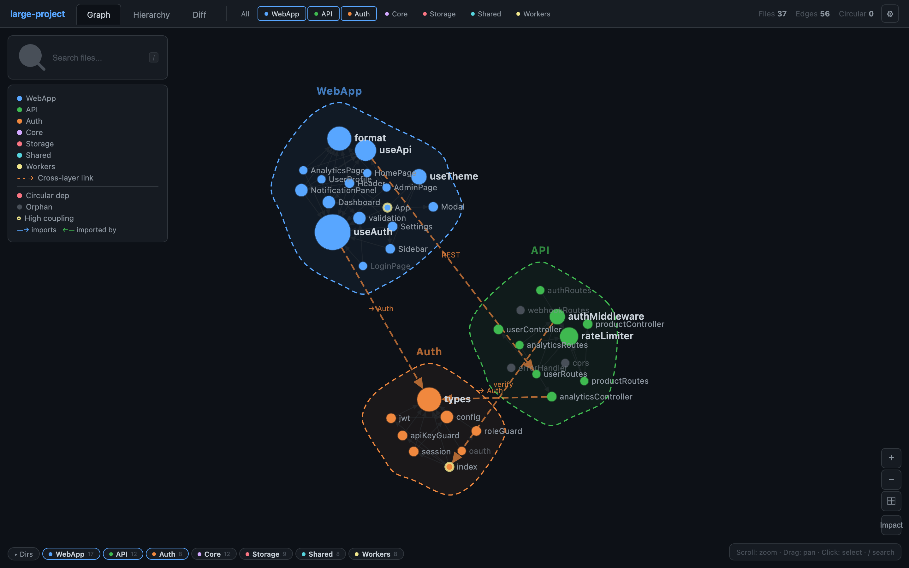

<p align="right">
  <a href="README.ja.md">🇯🇵 日本語</a>
</p>

<p align="center">
  
  
  
  
  
</p>

<h1 align="center">archtracker-mcp</h1>

<p align="center">
  <b>Architecture & Dependency Tracker for AI-Driven Development</b><br>
  MCP Server + CLI + Web Viewer + Claude Code Skills
</p>

<p align="center">
  <a href="#quick-start">Quick Start</a> &bull;
  <a href="#features">Features</a> &bull;
  <a href="#multi-layer-architecture">Multi-Layer</a> &bull;
  <a href="#web-viewer">Web Viewer</a> &bull;
  <a href="#mcp-tools">MCP Tools</a> &bull;
  <a href="#cli-commands">CLI</a>
</p>

---

## Why archtracker?

When AI agents modify code, they **miss cascading impacts**:

| Problem | Without archtracker | With archtracker |
|---------|-------------------|------------------|
| Agent changes `auth.ts` | Doesn't know 12 files depend on it | Instantly sees all 12 affected files |
| File renamed during refactor | AI references stale paths next session | `context` command gives current valid paths |
| New dependency added | No visibility into coupling increase | Diff report flags the architectural change |
| PR review | Manual dependency tracing | CI auto-checks for architecture drift |
| Multi-service project | No cross-boundary visibility | Layer-aware analysis with cross-layer link detection |

**archtracker-mcp** provides dependency analysis, snapshot diffing, impact simulation, and interactive visualization — all accessible via MCP tools, CLI, web UI, or Claude Code Skills.

## Features

- **Dependency Graph Analysis** — Regex-based static analysis for **13 languages** (JS/TS, Python, Rust, Go, Java, C/C++, C#, Ruby, PHP, Swift, Kotlin, Dart, Scala)
- **Multi-Layer Architecture** — Analyze multiple services/layers as a unified graph with cross-layer connection detection
- **Interactive Web Viewer** — Force-directed graph with convex hull layer grouping, hierarchy diagram, diff view with D3.js
- **Security Hardened** — XSS-safe HTML escaping, path traversal protection on all MCP tools (v0.6.0)
- **Impact Simulation** — Click any file to visualize transitive dependents (BFS traversal)
- **Snapshot Diffing** — Save architecture snapshots and detect drift over time
- **MCP Server** — 6 tools for Claude Code / AI agents via Model Context Protocol
- **Claude Code Skills** — 6 slash commands (`/arch-check`, `/arch-snapshot`, `/arch-serve`, etc.)
- **CI Integration** — `--ci` mode + auto-generated GitHub Actions workflow
- **Bilingual** — Full English/Japanese support (auto-detected from `LANG` env)
- **Dark/Light Theme** — Settings persist via localStorage
- **SVG/PNG Export** — Export dependency graphs for documentation

## Quick Start

### Install

```bash
npm install -g archtracker-mcp
```

### 1. Analyze your project

```bash
archtracker analyze --target src
```

### 2. Save a baseline snapshot

```bash
archtracker init --target src
```

### 3. Launch the web viewer

```bash
archtracker serve --target src --watch
# => http://localhost:3000
```

### 4. Check for architecture drift

```bash
archtracker check --target src
```

## Multi-Layer Architecture

For projects with multiple services or layers (e.g. frontend + backend + shared libraries), archtracker can analyze them as a unified graph.

### Setup

Create `.archtracker/layers.json` in your project root:

```json
{
  "version": "1.0",
  "layers": [
    {
      "name": "Frontend",
      "targetDir": "frontend/src",
      "language": "javascript",
      "color": "#58a6ff",
      "description": "React Web App"
    },
    {
      "name": "Backend",
      "targetDir": "backend/app",
      "language": "python",
      "color": "#3fb950",
      "description": "FastAPI Server"
    }
  ],
  "connections": [
    {
      "fromLayer": "Frontend",
      "fromFile": "api/client.ts",
      "toLayer": "Backend",
      "toFile": "main.py",
      "type": "api-call",
      "label": "REST API"
    }
  ]
}
```

Or generate a template:

```bash
archtracker layers init
```

### Usage

When `layers.json` exists, all commands automatically use multi-layer mode:

```bash
archtracker analyze --root .          # Analyzes all layers
archtracker serve --root . --watch    # Web viewer with layer tabs and convex hulls
archtracker check --root .            # Cross-layer diff check
```

Each layer is analyzed independently with its own language setting, then merged into a unified graph with prefixed paths (e.g. `Backend/worker.py`).

### Web Viewer with Layers

- **Layer tabs**: Multi-select toggle to focus on specific layers (Shift+click for solo mode)
- **Convex hulls**: Each layer is visually grouped with a colored boundary
- **Cross-layer links**: Dashed lines showing connections between layers (toggleable in settings)
- **Layer Cohesion slider**: Adjust how tightly nodes cluster within their layer
- **Diff highlighting**: Layer boundaries are highlighted when they contain changed files

## Web Viewer

The interactive web viewer provides three visualization modes:

### Graph View (Force-Directed)


- Drag, zoom, and click nodes to explore dependencies
- Click a node to **pin** its highlight — hover other nodes to compare
- Filter by directory with bottom pills, by layer with top tabs
- Adjust gravity, layer cohesion, node size, font size, link opacity
- **Impact mode**: click any file to see all transitively affected files


#### Layer Focus



- Shift+click a layer tab to **solo** it; click others to add
- Convex hulls show layer boundaries; dashed lines show cross-layer links
- Filtered physics automatically adjust for clearer separation

### Hierarchy View (DAG Layout)


- Layered top-down layout showing dependency depth
- Click-to-pin highlighting with detail panel
- Layer-aware filtering with compact relayout

### Diff View


- Color-coded visualization of architecture changes
- Green = added, Red = removed, Yellow = modified, Blue = affected
- Layer grouping with highlighted boundaries for changed layers
- Available when a snapshot exists for comparison

```bash
# Launch with auto-reload on file changes
archtracker serve --target src --port 3456 --watch
```

## MCP Tools

Add archtracker as an MCP server for Claude Code or any MCP-compatible AI agent:

```json
{
  "mcpServers": {
    "archtracker": {
      "command": "npx",
      "args": ["-y", "archtracker-mcp"]
    }
  }
}
```

| Tool | Description |
|------|-------------|
| `generate_map` | Analyze dependency graph and return raw JSON (for programmatic use) |
| `analyze_existing_architecture` | Comprehensive human-readable analysis report |
| `save_architecture_snapshot` | Save snapshot to `.archtracker/snapshot.json` |
| `check_architecture_diff` | Compare snapshot with current code, show impacts |
| `get_current_context` | Get valid file paths and architecture summary |
| `search_architecture` | Search by path, impact, criticality, or orphans |

All tools auto-detect multi-layer projects when `.archtracker/layers.json` exists.

## CLI Commands

```
archtracker init [options]       Generate initial architecture snapshot
archtracker analyze [options]    Comprehensive analysis report
archtracker check [options]      Compare snapshot with current code
archtracker context [options]    Show architecture context (for AI sessions)
archtracker serve [options]      Launch interactive web viewer
archtracker ci-setup [options]   Generate GitHub Actions workflow
archtracker layers init          Create template layers.json
archtracker layers list          List configured layers

Options:
  -t, --target <dir>       Target directory (default: "src")
  -r, --root <dir>         Project root (default: ".")
  -l, --language <lang>    Target language (auto-detected if omitted)
  -p, --port <number>      Port for web viewer (default: 3000)
  -w, --watch              Watch for file changes and auto-reload
  -e, --exclude <pattern>  Exclude patterns (regex)
  -n, --top <number>       Top N components in analysis (default: 10)
  --save                   Save snapshot after analysis
  --ci                     CI mode: exit 1 if review needed
  --json                   JSON output (context command)
  --lang <locale>          Language: en | ja (auto-detected from LANG)
```

> **Multi-layer note**: When `.archtracker/layers.json` exists and `--target` is not explicitly set, all commands automatically use multi-layer analysis. Use `--root` to specify the project root.

## Claude Code Skills

Copy the `skills/` directory to your project:

```bash
cp -r node_modules/archtracker-mcp/skills/ .claude/skills/
```

| Skill | Description |
|-------|-------------|
| `/arch-analyze` | Run comprehensive architecture analysis |
| `/arch-check` | Compare snapshot with current code |
| `/arch-snapshot` | Save current architecture snapshot |
| `/arch-context` | Initialize AI session with valid paths |
| `/arch-search` | Search architecture (path, impact, critical, orphan) |
| `/arch-serve` | Launch interactive web viewer in browser |

All skills support multi-layer projects automatically.

## Programmatic API

```typescript
import {
  analyzeProject,
  analyzeMultiLayer,
  saveSnapshot,
  loadSnapshot,
  computeDiff,
  formatDiffReport,
  formatAnalysisReport,
} from "archtracker-mcp";

// Single-directory analysis
const graph = await analyzeProject("src", { exclude: ["__tests__"] });

// Multi-layer analysis
const layers = [
  { name: "Frontend", targetDir: "frontend/src", language: "javascript" },
  { name: "Backend", targetDir: "backend/app", language: "python" },
];
const multi = await analyzeMultiLayer(".", layers);

// Snapshot
const snapshot = await saveSnapshot(".", graph);

// Diff
const prev = await loadSnapshot(".");
if (prev) {
  const diff = computeDiff(prev.graph, graph);
  console.log(formatDiffReport(diff));
}
```

## CI / CD

### Auto-generate GitHub Actions workflow

```bash
archtracker ci-setup --target src
# Creates .github/workflows/arch-check.yml
```

### Manual setup

```yaml
# .github/workflows/arch-check.yml
name: Architecture Check
on:
  pull_request:
    branches: [main]
jobs:
  arch-check:
    runs-on: ubuntu-latest
    steps:
      - uses: actions/checkout@v4
      - uses: actions/setup-node@v4
        with:
          node-version: "20"
      - run: npm ci
      - run: npx archtracker check --target src --ci
```

## i18n

Language is auto-detected from `LANG` / `LC_ALL` environment variables:

```bash
LANG=ja_JP.UTF-8 archtracker analyze   # Japanese output
archtracker --lang ja check             # Explicit Japanese
```

The web viewer also supports language switching via the settings panel.

## Requirements

- **Node.js** >= 18.0.0

Supported languages: JavaScript/TypeScript, Python, Rust, Go, Java, C/C++, C#, Ruby, PHP, Swift, Kotlin, Dart, Scala

## Contributing

See [CONTRIBUTING.md](CONTRIBUTING.md) for guidelines.

## License

[MIT](LICENSE) &copy; un907
